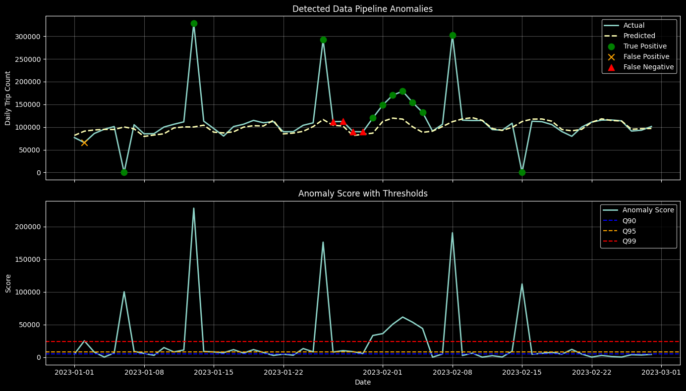
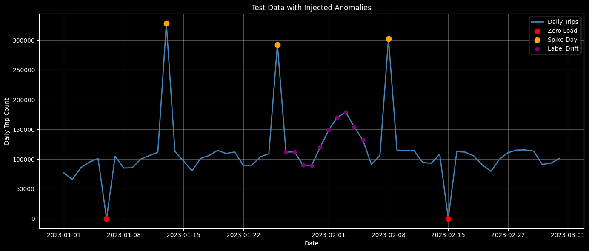

# ML-based anomaly detection

## Problem

Data pipelines fail quietly. A source system stops sending records, an aggregation job
double-counts a batch, or a metric's definition changes upstream — and none of these show up
as a hard error. They just show up as bad numbers, often discovered long after the fact by
someone downstream wondering why a dashboard looks wrong.

This project treats that as a time-series anomaly detection problem: learn what "normal" daily
demand looks like, forecast it, and flag points where reality deviates from the forecast.

Concretely, it targets three realistic pipeline failure modes:

| Failure mode | Real-world cause | Signature |
|---|---|---|
| **Zero-load** | Ingestion outage, pipeline failure | Value drops to (near) zero |
| **Spike day** | Duplicate records, aggregation bug | Value spikes far above normal range |
| **Label drift** | Metric definition change upstream | Value shifts gradually/subtly, harder to catch |

## Approach

The data is [NYC Yellow Taxi trip records](https://www.nyc.gov/site/tlc/about/tlc-trip-record-data.page), aggregated into a daily trip-count time series.

The core flow is:

```
Raw trip records
      │  aggregate to daily counts
      ▼
Daily time series
      │  STL decomposition + lag/rolling/calendar features
      ▼
Feature-rich model data
      │  tuned LightGBM regressor forecasts expected daily demand
      ▼
Forecast (expected demand)
      │  residual = actual − forecast, scored against learned quantile thresholds
      ▼
Anomaly flags + severity (low / medium / high)
```

The pipeline uses three role-based datasets:
- `model_train` and `model_test` for forecasting and model evaluation.
- `calibration_reference` for fitting anomaly thresholds from residuals on normal data.
- `anomaly_injected` for evaluation after synthetic anomalies are injected into the 2023 source data.

This keeps threshold-learning honest and provides ground truth for evaluation, since real
labelled anomalies are not available.

A simple untuned LightGBM model is also trained as a baseline to confirm that tuning improves
forecast accuracy before the tuned model becomes the reference for expected behavior.

## Results

These figures and metrics are generated from the synthetic anomaly evaluation workflow.

### Anomaly score and thresholds



The chart compares actual and forecast demand, marks detection outcomes, and shows anomaly scores
against the low, medium, and high residual thresholds learned from clean calibration data.

### Injected anomalies (ground truth)



### Detection performance (overall + by-type recall)

Overall performance against injected ground truth:

- TP: 13, FP: 1, FN: 5
- Precision: 0.93
- Recall: 0.72
- F1: 0.81

By anomaly type, recall is the most informative metric for detectability:

| Type | Recall | Detectability |
|---|---|---|
| Zero-load | 1.00 | Very high — near-zero values are unambiguous |
| Spike day | 1.00 | High — large deviations clear the threshold easily |
| Label drift | 0.62 | Moderate — gradual/subtle shifts are easier to miss |

Label drift remains the hardest failure mode to catch. Unlike sharp outages or spikes, drift evolves over multiple days and can stay within the model’s normal residual range.

Note: per-type precision is intentionally de-emphasized here, since type-level slices are conditioned on `true_anomaly_type`, which can make per-type precision appear artificially perfect and less useful for comparing detectability across anomaly classes.

### Alert-routing policy comparison

Notebook 05 keeps the fitted detector fixed and compares how its severity labels are routed for
the single injected label-drift episode. It reports three direct KPIs for each policy:

- `drift_detected`: whether the policy raises an alert during the drift episode.
- `detection_latency_days`: calendar days from the episode start to its first alert.
- `false_alerts`: alerts raised outside all injected anomalies.

The comparison is an exploratory notebook analysis and is not produced by the command-line
scripts. Its purpose is to contrast earlier drift detection with the added review burden of more
sensitive routing policies.

*(Exact numbers and the policy comparison are reproduced by re-running Notebook 05 end-to-end; see below.)*

## Repository structure

```
ml-based-anomaly-detection/
├── config.py                  # central path constants (data/model/results locations)
├── config.yaml                 # features, target, nested data_split config
├── data/
│   ├── raw/                    # source NYC Yellow Taxi trip data
│   └── processed/              # role-based prepared datasets and metadata sidecars
├── models/                     # saved tuned LightGBM model
├── results/                    # evaluation plots, thresholds, metrics
├── logs/                       # training run logs (results.json)
├── notebooks/
│   ├── 01_data_exploration.ipynb        # EDA: seasonality, trend, data quality baseline
│   ├── 02_feature_engineering.ipynb     # builds STL + lag/rolling/calendar features
│   ├── 03_model_training.ipynb          # tunes LightGBM, compares against untuned baseline
│   ├── 04_anomaly_injection.ipynb       # injects synthetic zero-load/spike/drift anomalies
│   └── 05_anomaly_detection.ipynb       # final evaluation, visualization, and policy comparison
├── scripts/
│   ├── build_daily_dataset.py      # raw trips -> daily aggregate (choose year)
│   ├── check_data_quality.py       # validate a prepared role-based dataset
│   ├── prepare_model_data.py       # build model_train, model_test, calibration_reference
│   ├── prepare_anomaly_data.py     # build anomaly_injected from anomaly source data
│   ├── train_model.py              # train/evaluate forecaster on model_train/model_test
│   ├── run_anomaly_detection.py    # fit thresholds on calibration_reference, detect on anomaly_injected
│   ├── plot_results.py             # optional standalone detection plot
│   └── plot_injected_anomalies.py  # plot injected anomaly ground truth
├── src/
│   ├── data/                   # loading, daily aggregation, anomaly injection
│   ├── data_quality/           # completeness, duplicate, and value-range checks
│   ├── features/               # STL decomposition, lag/rolling/calendar feature builders
│   ├── models/                 # LightGBM tuning (RandomizedSearchCV + TimeSeriesSplit)
│   ├── anomaly/                # residual-based AnomalyDetector
│   └── visualization/          # anomaly + evaluation plotting helpers
└── tests/                      # unit tests (anomaly injector)
```

## Tech stack

- Python, pandas, NumPy
- [LightGBM](https://lightgbm.readthedocs.io/) for demand forecasting
- scikit-learn (`RandomizedSearchCV`, `TimeSeriesSplit`, metrics)
- statsmodels (STL decomposition)
- matplotlib for visualization
- pytest for testing

## Getting started

Install project-specific dependencies (on top of the shared workspace environment providing
pandas/scikit-learn/LightGBM/matplotlib/Jupyter):

```bash
pip install -r requirements.txt        # runtime deps (statsmodels)
pip install -r requirements-dev.txt    # test deps (pytest)
```

Use the scripts below for the main workflow:

```bash
python scripts/build_daily_dataset.py --year 2022   # build 2022 daily aggregate
python scripts/build_daily_dataset.py --year 2023   # build 2023 daily aggregate
python scripts/prepare_model_data.py                # build model_train, model_test, calibration_reference
python scripts/train_model.py                       # tune/load model and evaluate on model_test
python scripts/prepare_anomaly_data.py              # build anomaly_injected dataset
python scripts/run_anomaly_detection.py             # fit thresholds on calibration_reference, detect on anomaly_injected
python scripts/plot_results.py                      # optional: save results/anomaly_timeseries.png
python scripts/plot_injected_anomalies.py           # save results/injected_anomalies.png
```

`scripts/train_model.py` reuses a saved tuned model by default; pass `--retrain` to force
re-tuning, or `--plot` to visualize the forecast against actuals.

For the canonical end-to-end evaluation, run `notebooks/05_anomaly_detection.ipynb` after the
script workflow. It writes `results/anomaly_results.csv`, `results/thresholds.json`,
`results/evaluation_summary.json`, and `results/anomaly_score.png`, then displays the alert-routing
policy comparison. The standalone `plot_results.py` command is optional and writes the alternate
`results/anomaly_timeseries.png` artifact.

Run a dataset-quality check when needed, for example:

```bash
python scripts/check_data_quality.py --dataset anomaly_injected
```

`config.yaml` contains one `data_split` block with three subkeys:
- `model` for model_train/model_test evaluation.
- `calibration` for residual threshold fitting.
- `anomaly` for anomaly injection base data.

Each persisted dataset writes a matching `.meta.json` sidecar with source year, source file,
split definition, and row count.

## Testing

```bash
PYTHONPATH=. pytest tests/
```